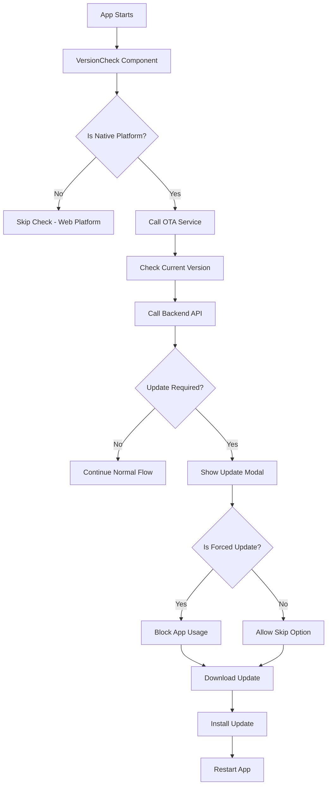

# OTA (Over-The-Air) Update Implementation

This document describes the complete OTA update system implemented for the Wadi Cab Capacitor app.

## Overview

The OTA update system allows administrators to push app updates to users without going through app stores. Users are automatically notified when updates are available and can download them directly within the app.

## Architecture

### Backend Components

#### 1. Database Model (`AppVersion.js`)
- **Location**: `backend/src/models/AppVersion.js`
- **Purpose**: Stores app version information and update metadata
- **Key Fields**:
  - `version`: Version string (e.g., "0.1.1")
  - `downloadUrl`: URL to download the update package
  - `releaseNotes`: Description of changes
  - `isActive`: Whether this version is available for updates
  - `isForced`: Whether users must update to this version
  - `minSupportedVersion`: Minimum supported version
  - `platform`: Target platform (android, ios, both)

#### 2. API Controller (`appVersionController.js`)
- **Location**: `backend/src/controllers/appVersionController.js`
- **Endpoints**:
  - `GET /api/v1/app-version/check` - Check for updates (public)
  - `GET /api/v1/admin/app-versions` - List all versions (admin)
  - `POST /api/v1/admin/app-versions` - Create new version (admin)
  - `PUT /api/v1/admin/app-versions/:id` - Update version (admin)
  - `DELETE /api/v1/admin/app-versions/:id` - Delete version (admin)
  - `PUT /api/v1/admin/app-versions/:id/toggle-active` - Toggle active status (admin)

#### 3. Admin Panel (`AppVersions.tsx`)
- **Location**: `backend/admin-dashboard/src/pages/AppVersions.tsx`
- **Features**:
  - View all app versions
  - Create new versions
  - Edit existing versions
  - Toggle active/inactive status
  - Set forced updates
  - Platform-specific versions

### Frontend Components

#### 1. OTA Update Service (`ota-update-service.ts`)
- **Location**: `frontend/lib/ota-update-service.ts`
- **Purpose**: Core service for handling OTA updates
- **Key Methods**:
  - `checkForUpdate()`: Check if updates are available
  - `downloadAndInstallUpdate()`: Download and install updates
  - `compareVersions()`: Compare version strings
  - `isVersionSupported()`: Check if version is supported

#### 2. Version Check Component (`version-check.tsx`)
- **Location**: `frontend/components/version-check.tsx`
- **Purpose**: UI component for update notifications
- **Features**:
  - Blocking modal for forced updates
  - Optional updates with skip option
  - Progress indicators during download
  - Error handling and retry functionality

#### 3. API Integration (`api.ts`)
- **Location**: `frontend/lib/api.ts`
- **Purpose**: API client for version checking
- **Method**: `versionAPI.checkForUpdate()`

## How It Works

### 1. Version Check Process



### 2. Update Flow

1. **App Launch**: VersionCheck component automatically runs on app start
2. **Platform Check**: Only runs on native platforms (Android/iOS)
3. **Version Comparison**: Compares current version with latest available version
4. **Update Decision**: Determines if update is required based on:
   - Version comparison
   - Forced update flag
   - Minimum supported version
5. **User Notification**: Shows appropriate UI based on update type
6. **Download & Install**: Uses CapacitorUpdater to download and install
7. **App Restart**: Automatically restarts app with new version

### 3. Admin Workflow

1. **Create Version**: Admin creates new version in admin panel
2. **Set Properties**: Configure download URL, release notes, platform, etc.
3. **Activate Version**: Toggle version to active status
4. **Force Update** (Optional): Mark as forced if required
5. **Monitor**: Track update adoption through admin panel

## Configuration

### Environment Variables

```bash
# Backend
MONGODB_URI=mongodb://localhost:27017/wadi_cab

# Frontend
NEXT_PUBLIC_API_URL= https://api.waadi.in/api/v1
```

### Package.json Version

The current app version is defined in `frontend/lib/ota-update-service.ts`:

```typescript
const CURRENT_VERSION = '0.1.0'; // Must match package.json version
```

**Important**: Update this constant whenever you update the package.json version.

## Usage Examples

### Creating a New Version (Admin)

1. Go to Admin Panel → App Versions
2. Click "Create Version"
3. Fill in the form:
   - **Version**: `0.1.2`
   - **Platform**: `both` (or specific platform)
   - **Download URL**: `https://github.com/vohraaYatinn/release-build/blob/main/push-notifications.zip`
   - **Release Notes**: `Bug fixes and new features`
   - **Force Update**: `false` (optional)
4. Click "Create Version"
5. Toggle to "Active" status

### Testing Updates

1. **Create Test Version**: Create a version higher than current (e.g., `0.1.1`)
2. **Set as Active**: Toggle the version to active
3. **Test on Device**: Launch app on device to see update prompt
4. **Verify Download**: Check that update downloads and installs correctly

## File Structure

```
backend/
├── src/
│   ├── models/AppVersion.js
│   ├── controllers/appVersionController.js
│   └── routes/appVersionRoutes.js
├── admin-dashboard/src/pages/AppVersions.tsx
└── scripts/seed-app-versions.js

frontend/
├── lib/
│   ├── ota-update-service.ts
│   └── api.ts (versionAPI)
├── components/version-check.tsx
└── app/layout.tsx (VersionCheck wrapper)
```

## API Endpoints

### Public Endpoints

#### Check for Updates
```http
GET /api/v1/app-version/check?currentVersion=0.1.0&platform=both
```

**Response**:
```json
{
  "success": true,
  "data": {
    "updateRequired": true,
    "latestVersion": "0.1.1",
    "downloadUrl": "https://github.com/vohraaYatinn/release-build/blob/main/push-notifications.zip",
    "releaseNotes": "Bug fixes and improvements",
    "isForced": false,
    "minSupportedVersion": "0.1.0"
  }
}
```

### Admin Endpoints

#### List Versions
```http
GET /api/v1/admin/app-versions?page=1&limit=20&platform=both
```

#### Create Version
```http
POST /api/v1/admin/app-versions
Content-Type: application/json

{
  "version": "0.1.2",
  "downloadUrl": "https://github.com/vohraaYatinn/release-build/blob/main/push-notifications.zip",
  "releaseNotes": "New features and bug fixes",
  "isForced": false,
  "minSupportedVersion": "0.1.0",
  "platform": "both"
}
```

#### Update Version
```http
PUT /api/v1/admin/app-versions/:id
Content-Type: application/json

{
  "isForced": true,
  "releaseNotes": "Critical security update"
}
```

#### Toggle Active Status
```http
PUT /api/v1/admin/app-versions/:id/toggle-active
```

#### Delete Version
```http
DELETE /api/v1/admin/app-versions/:id
```

## Dependencies

### Backend
- `mongoose`: Database ODM
- `express`: Web framework

### Frontend
- `@capgo/capacitor-updater`: OTA update functionality
- `@capacitor/core`: Capacitor core functionality

## Troubleshooting

### Common Issues

1. **Update Not Showing**
   - Check if version is active in admin panel
   - Verify version number is higher than current
   - Check platform compatibility

2. **Download Fails**
   - Verify download URL is accessible
   - Check network connectivity
   - Ensure URL points to valid zip file

3. **Installation Fails**
   - Check CapacitorUpdater configuration
   - Verify app has necessary permissions
   - Check device storage space

### Debug Logs

The system includes comprehensive logging. Check console for:
- `🔍 Checking for app updates...`
- `📊 Update check result:`
- `📥 Starting update download...`
- `✅ Download completed:`
- `🎉 Update installed successfully!`

## Security Considerations

1. **Download URLs**: Use HTTPS URLs only
2. **Version Validation**: Backend validates version format
3. **Platform Restrictions**: Can restrict updates to specific platforms
4. **Forced Updates**: Can force critical updates

## Future Enhancements

1. **Rollback Support**: Ability to rollback to previous versions
2. **Gradual Rollout**: Release updates to percentage of users
3. **Analytics**: Track update adoption rates
4. **Delta Updates**: Download only changed files
5. **Background Updates**: Download updates in background

## Support

For issues or questions regarding the OTA update system, please check:
1. Console logs for error messages
2. Admin panel for version status
3. Backend API responses
4. Device network connectivity

The system is designed to be robust and handle various edge cases, but proper testing on different devices and network conditions is recommended.

